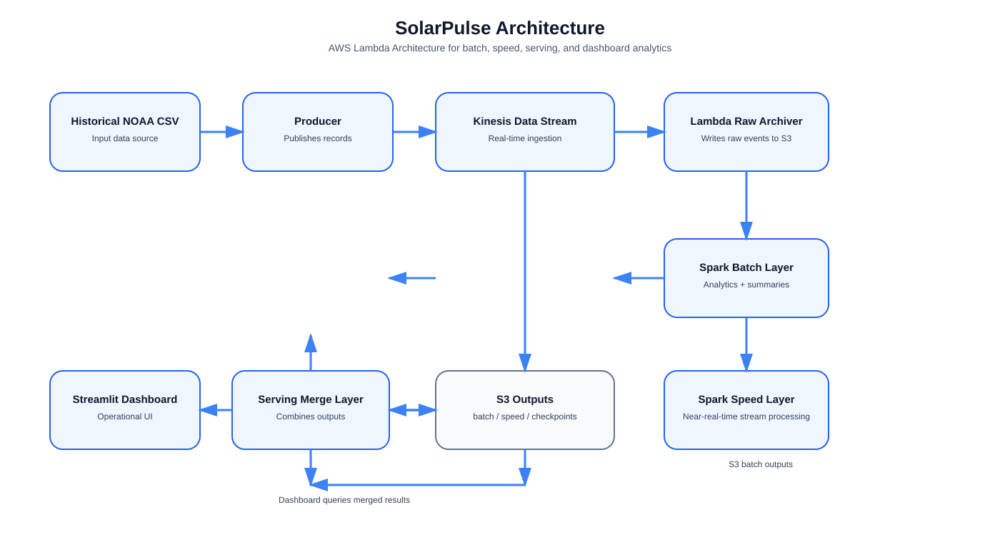

# SolarPulse

SolarPulse is an AWS-ready Lambda Architecture project for space-weather analytics, designed to fit an AWS Academy Learner Lab workflow. It includes local development paths and cloud deployment paths for ingestion, raw storage, Spark batch processing, Spark streaming, serving, dashboarding, and benchmarking.

## AWS Architecture



### End-to-End Flow

1. Historical weather data is ingested into the system through the producer.
2. Real-time records are published to Kinesis.
3. The Lambda raw archiver stores raw stream data in S3.
4. The Spark batch layer reads from S3-backed historical data and creates analytics outputs in S3.
5. The speed layer processes streaming events and writes near-real-time artifacts.
6. The serving layer merges the batch and speed outputs for the dashboard.
7. The Streamlit dashboard presents the final analytics and operational status.

## Learner Lab Strategy

Default path:

- `S3` for historical data and outputs
- `Kinesis Data Streams` for ingestion
- `Lambda` for raw-event archiving to S3
- `EC2` Spark host for batch and local Spark-based work

Optional upgrade path:

- `EMR on EC2` for stronger Spark execution and easier Kinesis Structured Streaming support

Why this split:

- Kinesis is a managed real-time ingestion service for streaming records. [AWS docs](https://docs.aws.amazon.com/streams/latest/dev/introduction.html)
- S3 can invoke Lambda on object or event workflows and is a natural data lake sink. [AWS docs](https://docs.aws.amazon.com/lambda/latest/dg/with-s3.html)
- EMR supports Spark and AWS documents a Kinesis Structured Streaming connector; EMR 7.1.0+ includes that connector. [AWS docs](https://docs.aws.amazon.com/emr/latest/ReleaseGuide/emr-spark-structured-streaming-kinesis.html)
- Amazon Linux 2023 ships with Corretto 17 and uses `dnf`, which is what the Spark host bootstrap relies on. [AWS docs](https://docs.aws.amazon.com/linux/al2023/ug/java.html), [AWS docs](https://docs.aws.amazon.com/linux/al2023/release-notes/support-info-by-support-statement.html)

## Project Layout

```text
SolarPulse/
├── batch/
│   ├── batch_processing.py
│   └── batch_utils.py
├── benchmark/
│   ├── parallel.py
│   └── sequential.py
├── dashboard/
│   └── app.py
├── data/
│   └── historical_space_weather.csv
├── infra/
│   └── learner_lab_stack.yaml
├── output/
├── producer/
│   └── producer.py
├── scripts/
│   ├── deploy_learner_lab.sh
│   └── sync_project_to_spark_host.sh
├── serving/
│   └── merge_results.py
├── speed/
│   ├── anomaly.py
│   ├── streaming.py
│   └── streaming_spark.py
└── requirements.txt
```

## What Is Implemented

- Spark batch layer that reads CSV or S3-backed CSV input and writes analytics outputs
- AWS-aware producer that can publish to Kinesis
- Local speed-layer scaffold for quick testing
- Spark Structured Streaming speed-layer job for Kinesis
- Learner Lab CloudFormation stack for S3, Kinesis, Lambda, and a Spark EC2 host
- Dashboard support for both local outputs and S3-backed outputs

## Local Quick Start

```bash
python3 -m venv .venv
source .venv/bin/activate
pip install -r requirements.txt
python3 batch/batch_processing.py --input data/historical_space_weather.csv --output output
streamlit run dashboard/app.py
```

## AWS Deployment

### 1. Prerequisites

- AWS CLI configured against your Learner Lab account
- An existing EC2 key pair in the target region
- Your VPC ID and one public subnet ID
- Your current public IP CIDR, for example `203.0.113.14/32`

### 2. Deploy the base stack

Use exact values from your lab account:

```bash
cd SolarPulse
chmod +x scripts/*.sh
./scripts/deploy_learner_lab.sh \
  solarpulse-stack \
  my-keypair \
  vpc-xxxxxxxx \
  subnet-xxxxxxxx \
  203.0.113.14/32 \
  eu-west-1
```

This creates:

- one S3 bucket
- one Kinesis stream with one shard
- one Lambda function that archives stream records into `raw/kinesis/`
- one EC2 Spark host with Java 17, Python, PySpark, boto3, Streamlit, and supporting libraries installed

### 3. Copy project code to the Spark host

Find the `SparkHostPublicIp` output, then:

```bash
./scripts/sync_project_to_spark_host.sh ec2-user@<spark-host-public-ip> /path/to/my-keypair.pem
```

### 4. Upload historical data to S3

Replace the bucket name with the `DataBucketName` stack output:

```bash
aws s3 cp data/historical_space_weather.csv s3://<bucket-name>/historical/historical_space_weather.csv
```

### 5. Start the producer into Kinesis

You can run this locally if your AWS CLI credentials are active, or on the Spark host. The producer now supports both replayed CSV data and a live public API feed.

Replay historical data into Kinesis:

```bash
python3 producer/producer.py \
  --source csv \
  --input data/historical_space_weather.csv \
  --mode kinesis \
  --stream-name solarpulse-stream \
  --region eu-west-1 \
  --rate 5
```

Stream a live public space-weather source (NOAA aurora snapshot feed) to stdout or Kinesis:

```bash
python3 producer/producer.py \
  --source api \
  --mode stdout \
  --api-url https://services.swpc.noaa.gov/json/ovation_aurora_latest.json \
  --api-max-polls 1
```

If you want to push the live space-weather feed into Kinesis instead, use:

```bash
python3 producer/producer.py \
  --source api \
  --mode kinesis \
  --stream-name solarpulse-stream \
  --region eu-west-1 \
  --api-url https://services.swpc.noaa.gov/json/ovation_aurora_latest.json \
  --api-max-polls 3 \
  --poll-interval 5
```

### 6. Run the batch layer against S3

```bash
python3 batch/batch_processing.py \
  --input s3://<bucket-name>/historical/historical_space_weather.csv \
  --output s3://<bucket-name>/batch
```

### 7. Run the speed layer

For quick local logic validation, use the non-Spark scaffold:

```bash
python3 speed/streaming.py --input data/historical_space_weather.csv --window-size 5
```

For the real AWS streaming path, use Spark Structured Streaming:

```bash
spark-submit speed/streaming_spark.py \
  --stream-name solarpulse-stream \
  --region eu-west-1 \
  --output s3://<bucket-name>/speed \
  --checkpoint s3://<bucket-name>/checkpoints/speed-layer
```

### 8. Run the dashboard against S3 outputs

Create `.streamlit/secrets.toml` with:

```toml
output_uri = "s3://<bucket-name>/batch"
```

Then:

```bash
streamlit run dashboard/app.py
```

## EMR Option

If Learner Lab allows EMR in your account, use EMR for the Spark streaming and heavier batch runs. AWS documents that EMR 7.1.0 and higher include the Kinesis Structured Streaming connector. [AWS docs](https://docs.aws.amazon.com/emr/latest/ReleaseGuide/emr-spark-structured-streaming-kinesis.html)

That means:

- batch on EC2 Spark host is acceptable and simpler
- streaming on EMR is the cleanest path if available
- if EMR is blocked in your lab, keep the EC2 host for batch and use the provided Spark streaming script as your reference implementation path

## Batch Outputs

The batch layer writes:

- `summary.json`
- `percentiles.json`
- `correlations.json`
- `daily_speed/`
- `monthly_speed/`
- `hourly_speed/`
- `storm_events/`
- `disturbance_breakdown/`

## Important Assumptions

- This scaffold assumes your Learner Lab region supports the services you deploy. If a service is disabled in your lab account, keep the code path and replace the runtime with the closest permitted alternative.
- The CloudFormation template uses a single public EC2 Spark host because that is usually easier to get running in student lab environments than a full multi-node Spark cluster.
- The Spark batch layer is fully runnable. The Spark streaming path is AWS-ready in structure, but whether you run it on plain EC2 or EMR depends on what your specific Learner Lab account allows.
